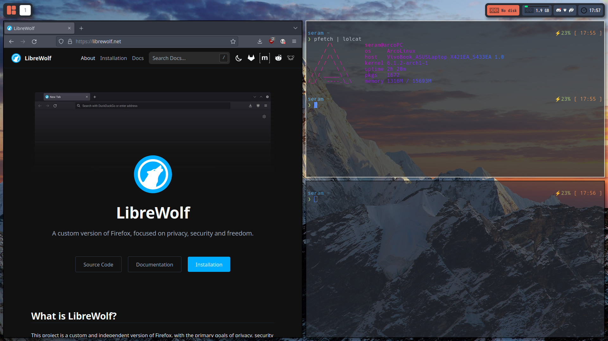
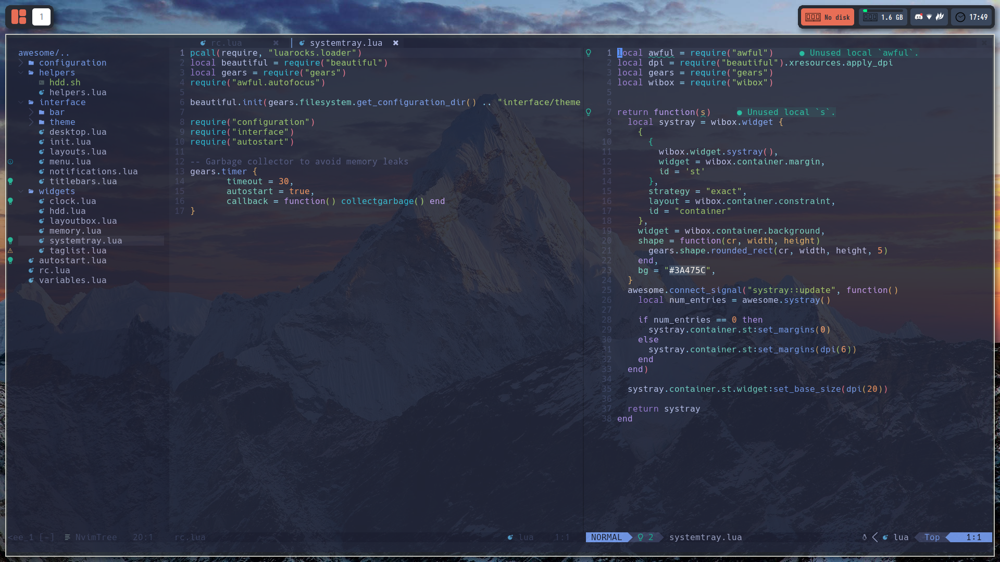

# Dotfiles
:

## <samp>OS Information</samp>
- **OS:** [ArcoLinuxS](https://arcolinux.com/)
- **Window Manager:** AwesomeWM git version (config is normally stable, however it can return unexpected errors). Most of the config is from [Crylia's theme](https://github.com/Crylia/crylia-theme), make sure to check it out.
- **Compositor:** [Picom (jonaburg's fork)](https://github.com/jonaburg/picom)
- **Terminal:** Alacritty (working on getting a non GPU-acceleration terminal to have a back-up)
- **Shell:** [Bash](https://tiswww.case.edu/php/chet/bash/bashtop.html)
- **Launcher:** [Rofi](https://github.com/davatorium/rofi)
- **Code editor:** [Neovim v0.8.3 (compiled from source)](https://github.com/neovim/neovim) (I hardly ever made any change or worry about any possible errors so expect some errors)

## Screenshots

